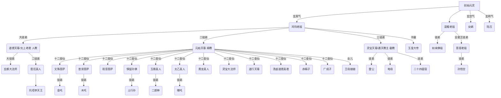

中国神仙的体系有很多种，下面是其中的一种：

```mermaid
graph TD
A[创始元灵]

A --> |玄青气| B1(鸿钧老祖)
A --> B2(混鲲老祖)
A --> |玄空气| B3(女娲)
A --> |玄明气| B4(陆压)

B1(鸿钧老祖) --> |大徒弟| B1C1(道德天尊/太上老君 人教)
B1(鸿钧老祖) --> |二徒弟| B1C2(元始天尊 阐教)
B1(鸿钧老祖) --> |三徒弟| B1C3(灵宝天尊/通天教主 截教)
B1(鸿钧老祖) --> |书童| B1C4(玉皇大帝)

B1C1(道德天尊/太上老君 人教) --> |大徒弟|B1C1D1(玄都大法师)
B1C1(道德天尊/太上老君 人教) --> |二徒弟|B1C1D2(度厄真人)

B1C1D2(度厄真人) --> B1C1D2E1(托塔李天王)

B1C2(元始天尊 阐教) --> |十二金仙| B1C2D1(文殊菩萨)
B1C2(元始天尊 阐教) --> |十二金仙| B1C2D2(普贤菩萨)
B1C2(元始天尊 阐教) --> |十二金仙| B1C2D3(观音菩萨)
B1C2(元始天尊 阐教) --> |十二金仙| B1C2D4(惧留孙佛)
B1C2(元始天尊 阐教) --> |十二金仙| B1C2D5(玉鼎真人)
B1C2(元始天尊 阐教) --> |十二金仙| B1C2D6(太乙真人)
B1C2(元始天尊 阐教) --> |十二金仙| B1C2D7(黄龙真人)
B1C2(元始天尊 阐教) --> |十二金仙| B1C2D8(灵宝大法师)
B1C2(元始天尊 阐教) --> |十二金仙| B1C2D9(道行天尊)
B1C2(元始天尊 阐教) --> |十二金仙| B1C2D10(清虚道德真君)
B1C2(元始天尊 阐教) --> |十二金仙| B1C2D11(赤精子)
B1C2(元始天尊 阐教) --> |十二金仙| B1C2D12(广成子)
B1C2(元始天尊 阐教) --> |女儿| B1C2D13(王母娘娘)

B1C3(灵宝天尊/通天教主 截教) --> |徒弟| B31(雷公)
B1C3(灵宝天尊/通天教主 截教) --> |徒弟| B32(电母)
B1C3(灵宝天尊/通天教主 截教) --> |徒弟| B33(二十四星宿)

B1C2D1(文殊菩萨) --> |徒弟| B1C2D1E1(金吒)
B1C2D2(普贤菩萨) --> |徒弟| B1C2D2E1(木吒)
B1C2D6(太乙真人) --> |徒弟| B1C2D6E1(哪吒)
B1C2D5(玉鼎真人) --> |徒弟| B1C2D5E1(二郎神)
B1C2D4(惧留孙佛) --> |徒弟| B1C2D4E1(土行孙)

B2(混鲲老祖) --> |徒弟| B2C1(如来佛祖)
B2(混鲲老祖) --> |全能王徒弟| B2C2(菩提老祖)

B2C2(菩提老祖) --> |徒弟| B2C2D1(孙悟空)
```

